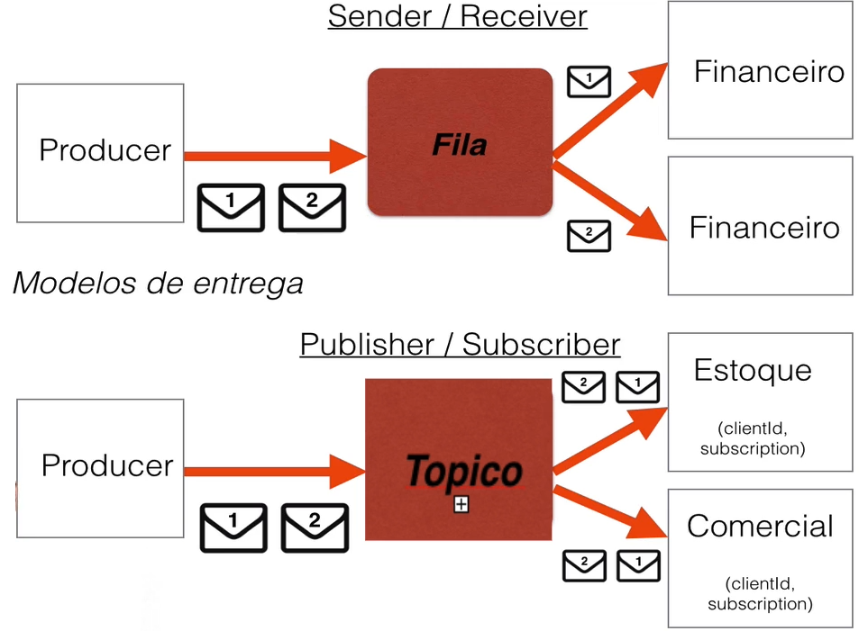

## activemq
##### Integração entre api's com ActiveMQ e JMS
[Lista de MOM(Message Oriented Middleware)](https://en.wikipedia.org/wiki/Message_broker)
##### EAI (Enterprise Application Integration) os 4 Estilos de Integração:
    1. File Transfer
    2. Shared Database
    3. Remote Procedure Invocation
    4. Messaging

    

###### 1. [Download ActiveMQ](https://activemq.apache.org/components/classic/download/)
###### 2. Descompactar o zip, entrar na pasta bin e executar o ActvieMQ
    sh activemq console 
###### 3. ActiveMQ WebConsole
    http://0.0.0.0:8161/
###### 4. ActiveMQ Jolokia REST API 
    http://0.0.0.0:8161/api/jolokia/
###### 5. Criar o Consumer e o Producer
	https://activemq.apache.org/jndi-support.html
###### 6. Criar os tópicos
    
###### 7. Seletor dentro do tópico
    https://activemq.apache.org/selectors.html

    - Não podem ser usados para buscar valores dentro do corpo da mensagem
    - Possuem uma sintaxe parecida com SQL para busca de informações.
    - Buscam valores apenas nos headers (cabeçalho) e properties (propriedades) das mensagens.

	*Producer*

	public void runTopiSelector(String msg, boolean ativo) {
		jmsTemplate.convertAndSend(new ActiveMQTopic(topic), msg, messagePostProcessor -> {
			messagePostProcessor.setBooleanProperty("item", ativo); //define o atrivo e o valor que o consumidor deve filtrar
			return messagePostProcessor;
		});
	}

	*Consumer*

	@JmsListener(id = "primeiroTopicoId",
                 destination = "${topic.primeiroTopico}",
                 containerFactory = "jmsFactoryTopic",
                 subscription = "primeiroTopico",
                 selector = "item is null OR item=true")
    public void onReceiverTopic(String str) {
        System.out.println(str);
    }

###### 8. Mensagens especificas e Tratamento de erro
    ActiveMq DLQ , Dead Letter Queue:
        - Ocorre quando um consumidor tentar ler a mensagem(queue ou topic) diversas vezes e não consegue, é jogado para uma fila especial chamada de activemq.DLQ

        - por padrão o ActiveMQ tenta entregar 6x a mensagem

    Tipos de Sessão no consumidor:
        - AUTO_ACKNOWLEDGE
        - CLIENT_ACKNOWLEDGE
        - SESSION_TRANSACTED (Session session = connection.createSession(true, Session.SESSION_TRANSACTED); > permite efeturar rollback na transação )

###### 9. Fila de Log
    Criar um projeto para salvar os logs

###### 10. Observações:
    - Ao produzir uma mensagem deve salvar ela? caso o ActiveMQ caía as mensagens ficam salvas(por padrão não ficam salvas, se cair elas somem).
        messagePostProcessor.setJMSDeliveryMode(DeliveryMode.PERSISTENT);

    - Prioridade da mensagem na fila, quanto maior o número mais alta a prioridade de 0 até 9
        messagePostProcessor.setJMSPriority(9);

        não vem por padrão com o suporte a priorização ativado, sendo necessário ativá-lo no arquivo activemq.xml
        
        ativando prioridade: http://activemq.apache.org/how-can-i-support-priority-queues.html

    - Tempo de vida de mensagem em milesegundos
        messagePostProcessor.setJMSDeliveryTime(5000);

