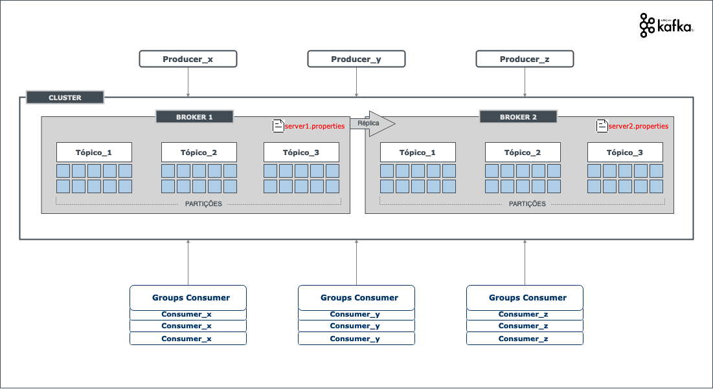

## Kafka - event streaming platform
* **Event Streaming** 
  * É a prática de capturar dados em tempo real de fontes de eventos como bancos de dados, sensores, dispositivos móveis, serviços em nuvem e aplicativos de software na forma de fluxos de eventos.
  * Armazenar esses fluxos de eventos de forma duradoura para recuperação posterior; manipular, processar e reagir aos fluxos de eventos em tempo real e também retrospectivamente.
  * Encaminhar os fluxos de eventos para diferentes tecnologias de destino, conforme necessário.
  * Garante um fluxo contínuo e interpretação dos dados para que as informações certas estejam no lugar certo, na hora certa.
* **Três principais recursos**
  * 1. **publish**(publicar) e **subscribe**(ler) fluxos de eventos, incluindo importação/exportação contínua de seus dados de outros sistemas.
  * 2. Armazenar fluxos de eventos de forma durável e confiável pelo tempo que você quiser.
  * 3. Processar fluxos de eventos conforme eles ocorrem.
* **Nutshell**
  * É um sistema distribuído formado por **servers** e **clients** que se comunicam via protocolo TCP.
  * É composto por 1 ou mais **clusters**, dentro de cada **cluster** é possível ter vários **servers**(instâncias) do kafka.
  * **Server** camada de armazenamento também chamado de broker.
  * **Client** camada que permite aplicativos e microserviços de lêr, gravar e processar fluxos de eventos em paralelo em escala tolerando falhas.
* **Principais conceitos**
  * **Event** registra o fato de que "algo aconteceu", também é chamado de **record** ou **message**.
  * Ao ler ou gravar dados no Kafka, você o faz na forma de **eventos**. Um evento possui uma **chave**, um **valor**, um **carimbo de data/hora** e **cabeçalhos de metadados** opcionail. Exemplo:    
    * Event key: "Fulano"
    * Event value: "Realizou um pagamento"
    * Event timestamp: "Jun. 25, 2020 at 2:06 p.m."
  * **Producers** são as aplicações clientes que publicam**(publish)** os eventos no Kafka.
  * **Consumers** são as aplicações clientes que lêem**(subscribe)** os eventos no Kafka.
  * **Rebalanceamento:** 
    * Os Consumers são capazes de fazer um rebalanceamente, caso alguma de suas instâncias fique indisponível as outras instâncias farão o rebalanceamneto distribuíndo as partições do Tópico entre elas.
      * Exemplo: 1 Tópico com 3 parições e 3 instâncias de um mesmo Consumer apontando para este Tópico, cadas instâncis do Consumer vai apontar para uma partição do Tópico, mas se cair uma instância do Consumer ele vai ficar com 2 instâncias e nessa hora acontece o rebalancemento onde uma das instâncias vai apontar para duas partições e a outra instância para uma partição do Tópico(3 partições para 2 instâncias do Consumer).
    * É possível fazer o rebalanceamento com mais de um Broker dentro do mesmo Cluster.

## Instalação Local
* quick start: https://kafka.apache.org/quickstart
* download: https://kafka.apache.org/downloads
* descompactar o zip
* rodar os comandos para subir o Kafka
  * zookeeper: ```bin/zookeeper-server-start.sh config/zookeeper.properties```
  * kafka: ```bin/kafka-server-start.sh config/server.properties```
* teste
  * criar um tópico: ```bin/kafka-topics.sh --create --topic teste-events --bootstrap-server localhost:9092```
  * listar os tópicos: ```bin/kafka-topics.sh --list --bootstrap-server localhost:9092```
  * descrever o tópico criado: ```bin/kafka-topics.sh --describe --topic teste-events --bootstrap-server localhost:9092```
  * escrever evento no tópico: ```bin/kafka-console-producer.sh --topic teste-events --bootstrap-server localhost:9092```
    * escrever a mensagem aqui ...
  * ler o evento do tópico: ```bin/kafka-console-consumer.sh --topic teste-events --from-beginning --bootstrap-server localhost:9092```

## Configuração diretórios do kafka e zookeeper
* Por padrão os dados do kafka são salvos na pasta /tmp podemos alterar isto para não perder os dados dele caso reinicie.
* criar uma pasta **/data** por exemplo dentro da raiz do kafka e criar os diretórios kafka e zookeeper
  * /data/zookeeper
  * /data/kafka
* Alterar os properties para mudar os diretórios default de armazenamento de dados kafka e zookeeper para os novos diretórios
  * nano config/server.properties
  * nano config/zookeeper.properties

## Criando os componentes Producer e Consumer com Java e Maven
* **Producer**
  * adicionar a dependência do kafka-clients
    ```
    	<dependency>
		    <groupId>org.apache.kafka</groupId>
		    <artifactId>kafka-clients</artifactId>
		    <version>2.6.0</version>
		</dependency>
    ```
  * Criar a classe que vai produzir a mensagem(Record)

* **Consumer**    
  * adicionar a dependência do kafka-clients
    ```
    	<dependency>
		    <groupId>org.apache.kafka</groupId>
		    <artifactId>kafka-clients</artifactId>
		    <version>2.6.0</version>
		</dependency>
    ```
  * Criar a classe que vai consumir a mensagem(Record)


## Parelelização
* **Partições do Tópico**
  * Partição é o número de instâncias do mesmo tópico que está rodando.
  * Podemos particionar os tópicos por exemplo em 3 partições, o kafka faz o gerenciamento da distribuição das mensagens para cada partição de um determinado tópico.
  * Para que a mensagem caia em partições diferentes do tópico, a **chave(key)** do record(mensagem) deve ser diferente.
  * Editar o **server.properties** o atributo **num.partition** e aumentar o limite de partições. Esse atributo define a quantidade de partições de cada tópico que for criado o defaul = 1.
  * Como alterar a partição de um tópico já criado?
    * ```bin/kafka-topics.sh --alter --zookeeper localhost:2181 --topic MEU_TOPICO --partitions 3```
* **Grupo**
  * Agrupamento dos **consumer** por tópico.
  * listar os grupos: ```bin/kafka-consumer-groups.sh --all-groups --bootstrap-server localhost:9092 --describe```
* **Informar para o Kafka que a mensagem já lida(commit)**
  * É uma **boa prática** dizer para o kafka que a mensagem já foi lida, pois resolve o problema de "commitar" a mensagem lida em lote, o kafka pode fazer um rebalancemaneto no meio de um processamento em lote(lista muito grande de mensagens) e a mensagens não serão lidas(commit).
    * configuração do pool(commit): ```properties.setProperty(ConsumerConfig.MAX_POLL_RECORDS_CONFIG, "1");```

## Enviando Objeto no Record(Mensagem)
* mudar o objeto para formato json, adicionar a dependência gson
```
	<dependency>
        <groupId>com.google.code.gson</groupId>
        <artifactId>gson</artifactId>
        <version>2.8.6</version>
    </dependency>
```
* mudar o serializer para uma classe que devemos criar, exemplo GsonSerializer que implementa o Serializer do kafka

## Cluster de Brokers
* É possível ter diversas réplicas do broker dentro do cluster.
* Criar novos brokers dentro do mesmo cluster, exemplo:
  * **/config/server1.properties** e alterar o atributo para **broker.id=1** (default é 0)
    * alterar o log atributo **log.dirs=/diretorio/data/kafka1/**
    * alterar a porta atributo **listeners=PLAINTEXT://:9091**
    * alterar o número de réplicas atributo **default.replication.factor=3**
    * alterar o número de réplicas atributo **offsets.topic.replication.factor=3**
    * alterar o número de réplicas atributo **transaction.state.log.replication.factor=3**
  * **/config/server2.properties** e alterar o atributo para **broker.id=2**
    * alterar o log atributo **log.dirs=/diretorio/data/kafka2/**
    * alterar a porta atributo **listeners=PLAINTEXT://:9092**
    * alterar o número de réplicas atributo **default.replication.factor=3**
    * alterar o número de réplicas atributo **offsets.topic.replication.factor=3**
    * alterar o número de réplicas atributo **transaction.state.log.replication.factor=3**
  * **/config/server2.properties** e alterar o atributo para **broker.id=3**
      * alterar o log atributo **log.dirs=/diretorio/data/kafka3/**
      * alterar a porta atributo **listeners=PLAINTEXT://:9093**
      * alterar o número de réplicas atributo **default.replication.factor=3**
      * alterar o número de réplicas atributo **offsets.topic.replication.factor=3**
      * alterar o número de réplicas atributo **transaction.state.log.replication.factor=3** 
* **Observação:**
  * os brokers pondem usar o mesmo zookeeper
  * o Broker líder é com id 0, caso ele caia o próximo líder será a réplica com id 1 e consecutivamente.
  
* **Estrutura de um Cluster**


## Acks e reliability
* Garantir que as informações foram replicadas para todos os brokers
* Configurar os **Producers** para esperar uma resposta ao enviar uma mensagem(record) que ela foi replicada.
  * Exemplo: ```properties.setProperty(ProducerConfig.AKS_CONFIG, "all");```

## CorrelationId
* Serve para rastrear os recods(mensagens) que são trafegadas, exemplo:
  * Criar uma classe Message genérica com um ```CorrelationId id``` e um payload ```Object payload```
  * CorrelationId classe criada que contém o id, este id vai ser gerado através de um método criado dentro da própria classe concatenando o prórprio id com o nome da classe que gerou este id + o novo id gerado.

## Retries e Async
* As mensagens podem não ser enviadas na mesma ordem.
* ...

## Deadletter
* No Consumer genérico, dentro do catch enviar uma mensagem para um Tópico de deadletter

## Offset
* Ao subir um consumer deve buscar as mensagens desde o início ou a última não lida?
 * para buscar a mensagem mais recente: ```properties.setProperty(ConsumerConfig.AUTO_OFFSET_RESET_CONFIG, "latest");```
 * para buscar a partir das mensagens mais antigas: ```properties.setProperty(ConsumerConfig.AUTO_OFFSET_RESET_CONFIG, "earliest");```

## Transactional
* Estratégia para garantir que a mensagem foi enviada/consumida apenas uma vez(sem duplicar).
* No Consumer garantir que a leitura será feita apenas quando o Producer enviar a mensagem e ela estiver disponível para o líder, ter sido replicada e commitada.

## Idempotência
* É a propriedade que algumas operações têm de poderem ser aplicadas várias vezes sem que o valor do resultado se altere após a aplicação inicial.
* Exemplo: Criar um novo usuário, se ele já foi criado não cria novamente.

## Boas pátricas
* Criar um componente genérico para **Producer** e **Consumer** utilizando a classe **Message**(classe criada com um correlationId para rastreamento e um objeto contendo a mensagem) e incluir como dependências nos demais componentes.
  * Criar um serializer e um deserializer em algum formato(json, xml e etc..) neste componente genérico para facilitar a leitura das mensagens no Producer e no Consumer.

## Comandos
```bin/zookeeper-server-start.sh config/zookeeper.properties```
```bin/kafka-server-start.sh config/server.properties```
```bin/kafka-topics.sh --create --topic teste-events --bootstrap-server localhost:9092```
```bin/kafka-topics.sh --list --bootstrap-server localhost:9092```
```bin/kafka-topics.sh --describe --topic teste-events --bootstrap-server localhost:9092```
```bin/kafka-topics.sh --alter --zookeeper localhost:2181 --topic MEU_TOPICO --partitions 3```
```bin/kafka-console-producer.sh --topic teste-events --bootstrap-server localhost:9092```
```bin/kafka-console-consumer.sh --topic teste-events --from-beginning --bootstrap-server localhost:9092```
```bin/kafka-consumer-groups.sh --all-groups --bootstrap-server localhost:9092 --describe```


## Referência
* https://kafka.apache.org/documentation/
