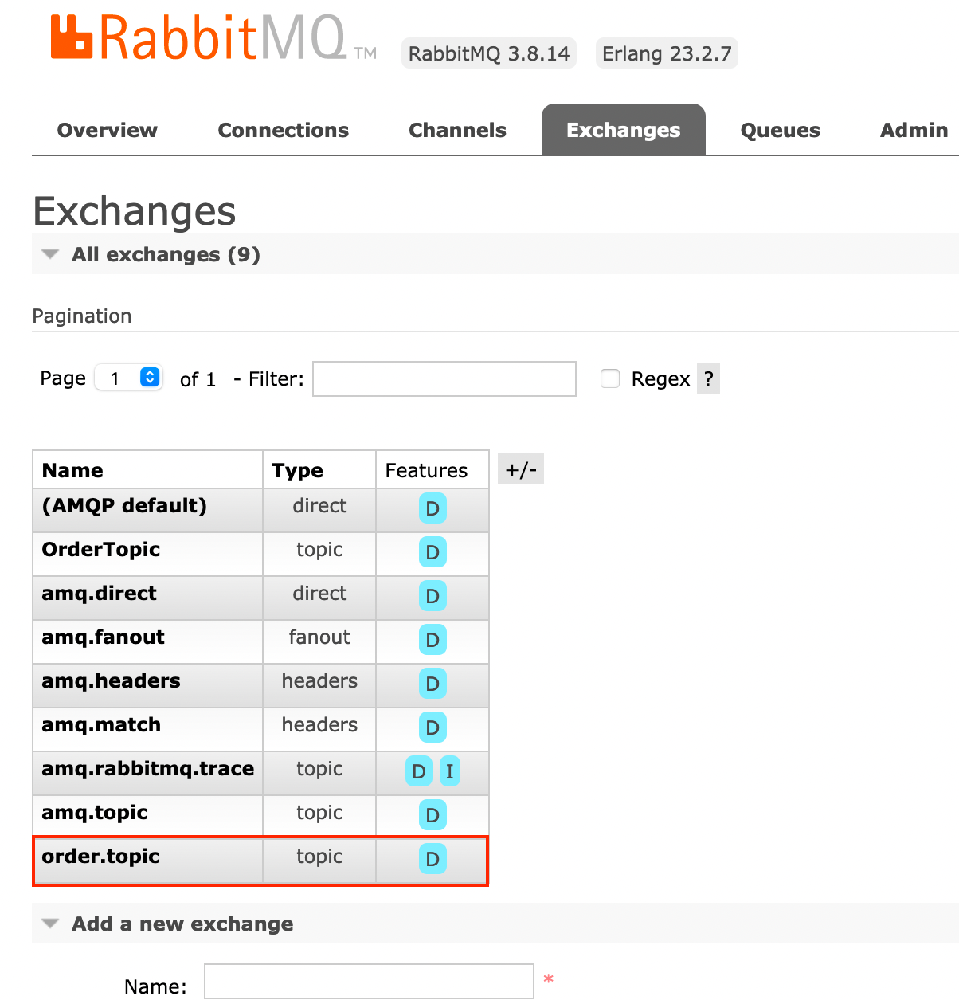
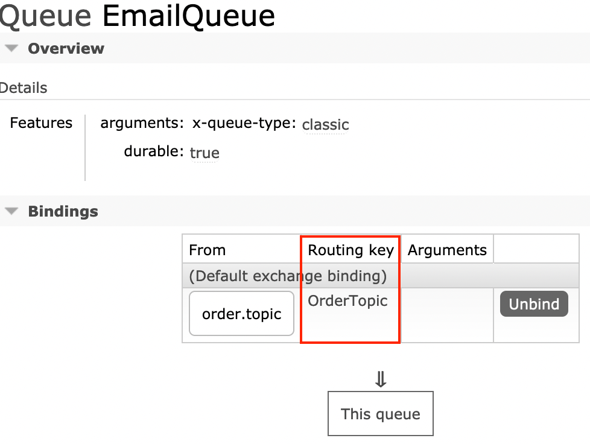
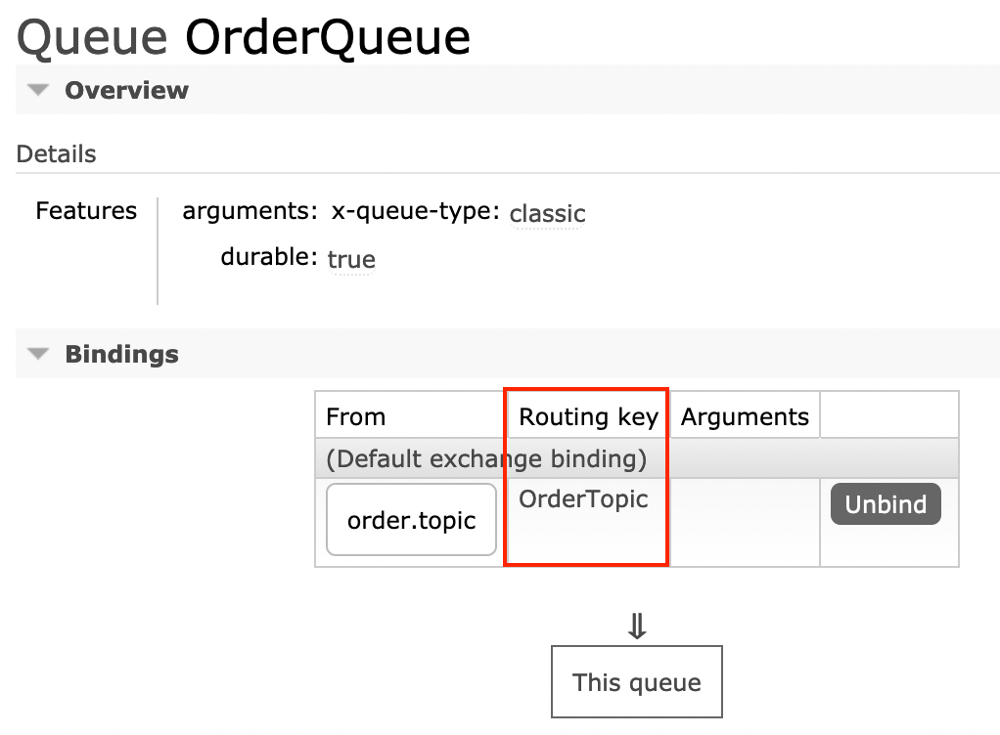

## AMQP message: exchanges, queues, and bindings. 
* Exchanges are where producers publish their messages.
* Queues are where the messages end up and are received by consumers. 
* Bindings are how the messages get routed from the exchange to particular queues.

## Exchanges
### Direct 
* Se a chave de roteamento corresponder, a mensagem será entregue à fila correspondente.

### Fanout
* Essa troca fará o multicast da mensagem recebida para as filas vinculadas. Ele será entregue a todas as filas anexadas a esta troca. 

### Topic
* As mensagens podem chegar à mesma fila vindo de fontes diferentes.
  * criar o tópico, order-topic
    
  * criar as filas e adicionar o biding com o nome do exchange/topico (order-topic), exemplo:
    
      

## Vhosts

## Reliability Guide

## Install on Docker - Raspberry Pi
* **Documentação:** https://www.rabbitmq.com/kubernetes/operator/quickstart-operator.html
* **Connectar no raspberry pi:** 
  * ssh ubuntu@192.168.15.7
* **Criar o RabbitMQ:**
  * docker run -dit --restart unless-stopped -p 5672:5672 -p 15672:15672 -p 15692:15692 --hostname rabbit-mq --name rabbit-mq rabbitmq:3
* **Entrar no container e habilitar o console:**
  * rabbitmq-plugins enable rabbitmq_management
* **Acessar o console externamente:** 
  * http://192.168.15.7:15672
  * guest/guest
* **Kubernetes:**
    * https://github.com/nickborges/springboot-base-rabbitmq/blob/master/kubernetes/rabbitmq.yaml